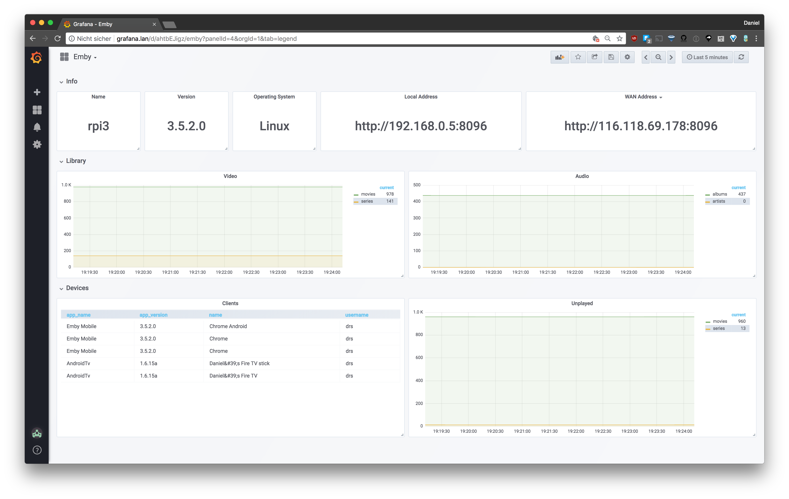

# emby_exporter.py

A prometheus exporter for emby written in Python 3.
The exporter scrapes emby's API and exposes prometheus metrics.
emby_exporter will call the API every 15 seconds by default, this can be adjusted through commandline arguments.

See [grafana_dashboard.json](grafana_dashboard.json)

# Content

- [emby_exporter.py](#embyexporterpy)
- [Content](#content)
- [Metrics](#metrics)
- [Setup](#setup)
	- [pip](#pip)
	- [manual](#manual)
	- [Docker](#docker)
		- [docker-hub](#docker-hub)
		- [manual](#manual)
- [Usage](#usage)
	- [Usage Example](#usage-example)

# Metrics

- info
- library_size
- devices

# Metrics Example

	    # HELP python_info Python platform information
	    # TYPE python_info gauge
	    python_info{implementation="CPython",major="3",minor="7",patchlevel="0",version="3.7.0"} 1.0
	    # HELP emby_info emby info
	    # TYPE emby_info gauge
	    emby_info{id="5924731cb9904e3b9862475bad630a50",local_address="http://192.168.0.5:8096",operating_system="Linux",server_name="rpi3",version="3.5.2.0",wan_address="http://146.128.69.118:8096"} 1.0
	    # HELP emby_library_size emby library size
	    # TYPE emby_library_size gauge
	    emby_library_size{type="movies"} 969.0
	    emby_library_size{type="series"} 141.0
	    emby_library_size{type="episodes"} 8873.0
	    emby_library_size{type="albums"} 0.0
	    emby_library_size{type="artists"} 0.0
	    emby_library_size{type="songs"} 0.0

# Setup

## pip
    pip3 install --upgrade git+https://github.com/dr1s/emby_exporter.py.git

## manual
    git clone https://github.com/dr1s/emby_exporter.py.git
    cd emby_exporter.py
    pip3 install -r requirements.txt
    cd emby_exporter
    ./emby_exporter.py

## Docker

### docker-hub
    docker pull dr1s/emby_exporter:latest
    docker run --net=host -t dr1s/emby_exporter

### manual
    git clone https://github.com/dr1s/emby_exporter.py.git
    docker build -t dr1s/emby_exporter .
    docker run -d --net=host -t dr1s/emby_exporter

# Usage
	usage: emby_exporter.py [-h] [-e EMBY] [-p PORT] [-i INTERFACE] [-a AUTH]
	                        [-u USERID] [-s INTERVAL]

	emby_exporter

	optional arguments:
	  -h, --help            show this help message and exit
	  -e EMBY, --emby EMBY  emby adress
	  -p PORT, --port PORT  port emby_exporter is listening on
	  -i INTERFACE, --interface INTERFACE
	                        interface emby_exporter will listen on
	  -a AUTH, --auth AUTH  emby api token
	  -u USERID, --userid USERID
	                        emby user id
	  -s INTERVAL, --interval INTERVAL
	                        scraping interval in seconds

## Usage Example

    emby_exporter --emby localhost:8069 --interface 0.0.0.0 --port 9123 --interval 15 --auth <emby_api_token> --userid <emby_user_id>

The previous used arguements are the default options. All options are options except for the emby api token and userid.
